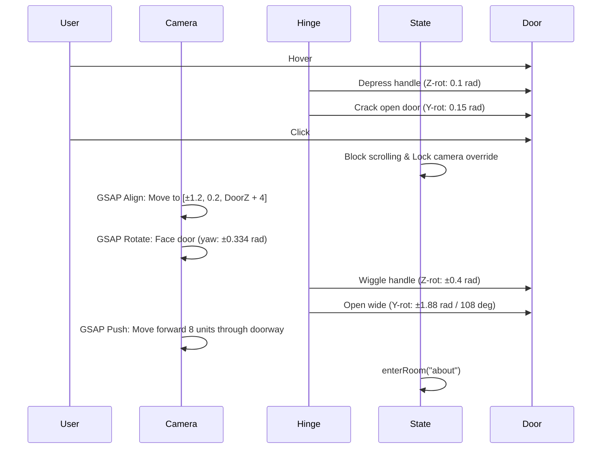

# ITom Dev (itomdev.com) "About" Door & Room Technical Architecture Reference

This document provides a complete reverse-engineered spec of the **About** door and room sequence from Tomasz Szmajda's portfolio website ([itomdev.com](https://itomdev.com)). It captures the layout, animations, shaders, and scroll-bound physics, serving as a ready-to-replicate blueprint for custom integrations.

---

## 1. Door Layout & Room Entry Sequence

The transition from the 3D sketch corridor into the color-painted WebGL room consists of three stages: **Hone-In (Camera Zoom/Align)**, **Door Opening & Handle Wiggle**, and **Corridor to Room Teleport**.

### A. Door 3D Mesh Composition
The door is built as a composite of layered planes and a frame mesh:
1. **Wall Segment with Hinge Cutout**: A custom shape mesh (`ShapeGeometry`) representing the corridor wall with a hole cut out for the door leaf:
   - Width: `2.5` units, Height: `3.5` units.
   - Hinge coordinate: `r === 'left' ? -1.25 : 1.25` on the X-axis.
2. **Door Frame**: A static outline sketch mesh (`/textures/corridor/doors/ramkasingledoors.webp`).
3. **Door Panel (Rotatable Group)**: Housed inside a group ref rotated around the hinge point on click/hover:
   - **Default/Sketch Texture**: `/textures/corridor/doors/drzwiabout.webp`.
   - **Hover/Painted Texture**: `/textures/corridor/doors/drzwiabout_painted.webp` (rendered on top via `RevealMaterial`).
   - **Back Face Texture**: `/textures/corridor/doors/door_back.webp` (visible once the camera passes through).
4. **Door Handle Group**: Rotates separately on z-axis to simulate a mechanical handle depress on hover/click:
   - **Textures**: `/textures/corridor/doors/klamkadodrzwi.webp` and `klamkadodrzwi_painted.webp`.

### B. Interaction & Trigger Flow


### C. GSAP Animation Implementation Reference
```typescript
// Click callback to align and push camera
const onDoorClick = useCallback(() => {
  if (isAnimating) return;
  setIsAnimating(true);
  
  // 1. Lock scroll inputs
  document.body.style.cursor = 'auto';
  
  // 2. Align Camera to Doorway (Yaw calculation relative to hinge side)
  const targetYaw = side === 'left' ? Math.PI * 0.334 : -Math.PI * 0.334;
  const targetZ = doorZ;
  const targetX = side === 'left' ? 1.2 : -1.2;
  
  gsap.timeline()
    .to(camera.position, {
      x: targetX,
      z: targetZ,
      duration: 1.0,
      ease: 'power2.inOut'
    })
    .to(camera.rotation, {
      y: targetYaw,
      duration: 1.0,
      ease: 'power2.inOut',
      onComplete: () => startDoorSwing()
    });
}, []);

// Swing door leaf open and push camera through
const startDoorSwing = () => {
  // Play sound: /sounds/otwarciedrzwi.mp3
  
  // Handle depress wiggle
  gsap.to(handleRef.current.rotation, {
    z: side === 'left' ? 0.4 : -0.4,
    duration: 0.15,
    ease: 'power2.out'
  });
  
  // Swing leaf
  const targetAngle = side === 'left' ? Math.PI * 0.6 : -Math.PI * 0.6;
  gsap.to(doorLeafRef.current.rotation, {
    y: targetAngle,
    duration: 0.7,
    ease: 'power2.out',
    onComplete: () => {
      // Push camera forward along its look vector (8 units)
      const lookDir = new THREE.Vector3();
      camera.getWorldDirection(lookDir);
      
      gsap.to(camera.position, {
        x: camera.position.x + lookDir.x * 8.0,
        z: camera.position.z + lookDir.z * 8.0,
        duration: 1.5,
        ease: 'power2.inOut',
        onComplete: () => {
          enterRoom('about');
        }
      });
    }
  });
};
```

---

## 2. Scroll Flight Physics & Plan Locking

Once inside the **About** room, the camera is positioned at the start of a scroll-bound flight path. The user traverses this path by scrolling forward/backward. Instead of the camera moving in coordinate space, the **scene assets are offset in Z** based on scroll progress, keeping the camera anchored to process the physics wiggles.

### A. Damped Scroll Accumulator
Mouse wheel and touch inputs are accumulated into a target scroll velocity and smoothed using linear interpolation (lerp) for springy, fluid movement.
- **Scroll Step**: `wheelDelta * 0.002` (Desktop) / `touchDelta * 0.005` (Mobile).
- **Damping Coefficient**: `0.95` per frame (deceleration).
- **Scroll Accumulator**: `scrollProgress += velocity * deltaTime * 60`.

### B. Flight Turbulence and Banking (Pitch & Roll)
To simulate the sensation of a paper plane flying along the sketch blueprint:
1. When scrolling moves (`scrollProgress > 0.5`), the camera's base rotation yaw/pitch/roll is offset by dynamic flight wiggles.
2. The wiggles are calculated using phase-shifted sine waves mapped to the accumulated scroll distance.
3. The paper plane mesh sits in front of the camera and banks (tilts) to match the wiggles, visualizing inertial forces.

```typescript
// useFrame physics loop inside the About Room
useFrame((state, delta) => {
  if (isTeleporting || isExiting) return;

  // 1. Decelerate scroll velocity
  scrollVelocity.current *= 0.95;
  if (Math.abs(scrollVelocity.current) < 0.001) {
    scrollVelocity.current = 0;
  }
  
  // 2. Accumulate position
  scrollProgress.current += scrollVelocity.current * delta * 60;
  
  // Unlock achievement on threshold
  if (scrollProgress.current > 15) {
    unlockAchievement('about_fly');
  }

  // 3. Calculate Turbulence & Banking Angle
  if (scrollProgress.current > 0.5) {
    // Wave length loop interval (Ls = 40 units)
    const phase = (scrollProgress.current % 40) / 40;
    
    // Z-Rotation Wiggle (Roll/Banking): 1 full wave
    let targetRoll = Math.sin(phase * Math.PI * 2) * 0.12;
    // X-Rotation Wiggle (Pitch/Turbulence): 2 waves
    let targetPitch = Math.sin(phase * Math.PI * 4) * 0.05;
    
    // Smooth entry transition (fade-in turbulence over first 5 units)
    const fade = Math.min(1, (scrollProgress.current - 0.5) / 5);
    targetRoll *= fade;
    targetPitch *= fade;
    
    // Interpolate camera wiggles
    const lerpFactor = 1 - Math.pow(0.02, delta);
    currentRoll.current = MathUtils.lerp(currentRoll.current, targetRoll, lerpFactor);
    currentPitch.current = MathUtils.lerp(currentPitch.current, targetPitch, lerpFactor);
    
    // Apply to camera rotations (relative to baseline rotation)
    camera.rotation.x = baselineRotation.current.x + currentPitch.current;
    camera.rotation.z = baselineRotation.current.z + currentRoll.current;
    
    // 4. Bank Paper Plane Mesh (tilt opposite to camera rotation to simulate drag/inertia)
    if (planeRef.current) {
      planeRef.current.rotation.x = currentPitch.current * 3.0 + 0.1; // nose up/down
      planeRef.current.rotation.z = -currentRoll.current * 2.0;       // wing tilt
    }
  }
});
```

---

## 3. Infinite Sky Chunking & Cloud Drift System

The sky background is populated with randomized floating clouds that billboard toward the camera, drift laterally, and are infinitely chunked to prevent resource exhaustion.

### A. Sky Chunking Engine
The corridor is divided into chunks of length `En = 40` units. The scene tracks the scroll progress and loads chunks dynamically:
- Active chunks: `[currentChunk - 1, currentChunk, currentChunk + 1, currentChunk + 2]`.
- As a chunk falls behind the camera (`position.z + scrollProgress > -10`), its opacity fades to `0` and it is eventually culled.

```typescript
// Chunk indexing inside the parent timeline
const currentChunk = Math.floor(scrollProgress / 40);
const activeChunks = [currentChunk - 1, currentChunk, currentChunk + 1, currentChunk + 2];

return (
  <group position={[0, 0, scrollProgress]}>
    {activeChunks.map((idx) => (
      <SkyChunk 
        key={`chunk-${idx}`} 
        chunkIndex={idx} 
        scrollProgressRef={scrollProgress} 
      />
    ))}
  </group>
);
```

### B. Cloud Asset Properties
Clouds utilize 8 distinct transparent webp textures with specific aspect ratios (width/height):
- `/textures/clouds/1131c3eb-dfae-423f-924b-ff39d8ccd6dc.webp` (Aspect: 1.894)
- `/textures/clouds/254b8ec8-d6f7-4275-956f-7bab65b2ce2d.webp` (Aspect: 2.459)
- `/textures/clouds/2cc88dd1-483c-466d-b07e-f8308c61ccbe.webp` (Aspect: 3.577)
- `/textures/clouds/5606fcc0-3252-447d-a58a-7bcbac73229a.webp` (Aspect: 1.794)
- `/textures/clouds/7882dc72-3d01-41fb-ac0e-d07b0184ebc1.webp` (Aspect: 1.997)
- `/textures/clouds/9b2ca72f-7bd0-473b-ba6e-dd9e0eb79d35.webp` (Aspect: 1.905)
- `/textures/clouds/c83293c6-d90c-4a32-8d9d-5ac9af7e2296.webp` (Aspect: 3.000)
- `/textures/clouds/f6e358bc-d27c-41dd-95f4-6787a835c41e.webp` (Aspect: 1.875)

### C. Pseudo-Random Placement & Wind Drift Math
A seed-based random number generator (`hashRandom(seed)`) places clouds uniformly per chunk:
- **Lateral Range (X)**: `±10` units.
- **Vertical Range (Y)**: `±6` units.
- **Drift & Bobbing Formula**:
  $$\text{windOffset}_x = \sin(\text{time} \cdot \text{driftSpeed} + \text{offset}) \cdot \text{driftAmount}$$
  $$\text{bobOffset}_y = \sin(\text{time} \cdot \text{driftSpeed} \cdot 0.7 + \text{offset} + 1.5) \cdot \text{bobAmount}$$
- **Fly-by Separation**: As the cloud draws level with the plane, it is pushed rapidly outward on the X-axis to clear the flight path:
  $$\text{lateralSpread}_x = \text{transition}(Z) \cdot 15.0 \cdot \text{sign}(X)$$
- **Billboarding**: To make the 2D clouds look thick in 3D, their quaternions copy the camera's rotation multiplied by a fixed offset:
  $$Q_{\text{cloud}} = Q_{\text{camera}} \times R_{\text{offset}}(0, -\frac{\pi}{3}, 0)$$

---

## 4. Interior Scene Elements & Segment Layouts

The About Room flight is divided into 4 sequential story beats, repeating every `Cr = 160` units. Each story beat is anchored at a fixed offset:

```
[Camera Start (z=0)] 
  ├── Segment 1: Header / Cloud Avatar (z = -15)
  ├── Segment 2: Awards Certificates (z = -55)
  ├── Segment 3: Career & Journey Islands (z = -95)
  └── Segment 4: Skill Balloons (z = -135)
```

### Segment 1: Header & Cloud Avatar (z = -15)
- **Visuals**:
  - Name header: "TOMASZ SZMAJDA" (Font: `RubikScribble-Regular`, Size: `0.8`).
  - Subtitle: "(ITOM)" (Font: `CabinSketch-Regular`, Size: `0.45`) at `Y = 4.3`.
  - Profile Image: `/textures/about/awatarnachmurce.webp` (Scale: `6 x 3.2`) at `Y = 2.0`.
  - Floating Quote: "Crafting digital experiences that push creative boundaries" (Size: `0.32`).
- **Scroll Transition (Depth Sweep)**:
  - Interpolation factor $k$ is calculated as the cloud approaches the threshold $[ -70, -50 ]$.
  - Elements slide into alignment from opposing sides:
    - Header text slides left: $X = -k \cdot 12.0$.
    - Subtitle slides right: $X = k \cdot 9.0$.
    - Avatar floats up: $Y = 2.0 + \sin(\text{time} \cdot 0.8) \cdot 0.15 + k \cdot 3.0$.

### Segment 2: Awards & Certificates (z = -55)
- **Visuals**:
  - Main Title: "AWARDS" (Font: `RubikScribble-Regular`, Size: `1.2`).
  - 3 certificates: SOTD (left, $X=-5.0$), SOTM (center, $X=0.0$), SOTY (right, $X=5.0$).
  - Images: `/textures/about/SOTD.webp`, `SOTM.webp`, `SOTY.webp` (painted versions suffixed with `_painted.webp`).
- **Interactive States**:
  - Hovering a certificate triggers the **Reveal shader** (`RevealBasicMaterial`), changing the sketch art into the painted texture with a brush-stroke sweep from top to bottom.
  - Clicking "VIEW" opens a 2D split-screen detailed layout overlay (`openOverlay(award_data)`).
- **Depth Entry**:
  - SOTD slides in from left: $X = -O \cdot 5.0$.
  - SOTM slides in from right: $X = O \cdot 5.0$.
  - SOTY slides up from bottom: $Y = 0.5 + B \cdot 2.5$.

### Segment 3: Career & Journey Islands (z = -95)
- **Visuals**:
  - Title: "JOURNEY" (Size: `1.2`), Subtitle: "My path so far..." (Size: `0.35`).
  - Left island: University/Education (`uowyspa.webp`) at `X = -3.5`, `Y = -1.0`, labelled "2025-NOW".
  - Right island: Freelance Studio (`freelancewyspa.webp`) at `X = 3.5`, `Y = -2.0`, labelled "2023-NOW".
- **Float Physics**:
  - University island bobbing:
    $$Y = Y_{\text{base}} + \sin(\text{time} \cdot 0.5) \cdot 0.2$$
    $$Z_{\text{rot}} = \sin(\text{time} \cdot 0.3) \cdot 0.05$$
  - Freelance island bobbing:
    $$Y = Y_{\text{base}} + \sin(\text{time} \cdot 0.4 + 2.0) \cdot 0.25$$
    $$Z_{\text{rot}} = -\sin(\text{time} \cdot 0.2 + 1.0) \cdot 0.05$$

### Segment 4: poppable Skill Balloons (z = -135)
- **Visuals**:
  - Main Title: "SKILLS", Subtitle: "Technologies I love working with".
  - 10 floating balloons (React, Three.js, GSAP, JS, CSS, Next.js, HTML, Git, Figma, Firebase).
  - Textures: `/textures/about/[skill]duzybalon.webp` (or `srednibalon.webp` / `malybalon.webp`).
- **Hover & Physics Interaction**:
  - Hovering wiggles the balloon using the pointer position:
    $$\text{offset}_x = (\text{mouse}_x - \text{balloon}_x) \cdot 0.15$$
    $$\text{offset}_y = (\text{mouse}_y - \text{balloon}_y) \cdot 0.15$$
  - As you approach the balloons, they spread wide on the X-axis to float past the viewport.
- **Balloon Pop (Click Event)**:
  - Clicking a balloon triggers a pop sound (`/sounds/baloonpoop.mp3`) and triggers the pop animation.
  - Scale shrinks rapidly to `0` over `0.2` seconds.
  - Replaced by floating 3D text showing the skill name (e.g., "React") in `RubikScribble-Regular` outline text, which fades away.

---

## 5. Custom GLSL Transition Shaders

Two custom shaders drive the transition effects: the **2D Brush Reveal** for hover transitions and the **3D Wet Paint Reveal** for room entry.

### A. 2D Brush-Stroke Reveal (`RevealBasicMaterial`)
Used to transition an element from line-art sketch style to painted color on hover. It uses custom 2D noise to generate a jagged edge that sweeps vertically.

```glsl
// Uniforms
uniform float uProgress; // Range: 0.0 -> 1.0
uniform sampler2D map;

// Fragment Shader Injection (replacing #include <alphatest_fragment>)
#include <alphatest_fragment>

// Pseudo-random hashing function
float revealRand(vec2 n) { 
    return fract(sin(dot(n, vec2(12.9898, 4.1414))) * 43758.5453);
}

// 2D Value Noise
float revealNoise(vec2 p) {
    vec2 ip = floor(p);
    vec2 u = fract(p);
    u = u * u * (3.0 - 2.0 * u);
    float res = mix(
        mix(revealRand(ip), revealRand(ip + vec2(1.0, 0.0)), u.x),
        mix(revealRand(ip + vec2(0.0, 1.0)), revealRand(ip + vec2(1.0, 1.0)), u.x),
        u.y
    );
    return res * res;
}

void main() {
    // Map UV coordinates
    vec4 texColor = texture2D(map, vMapUv);
    
    // Discard pixels progressively based on height + noise
    if (uProgress > 0.001) {
        float rn = revealNoise(vMapUv * 15.0) * 0.15;
        float maskValue = (1.0 - vMapUv.y) + rn;
        float threshold = uProgress * 1.5;
        if (maskValue < threshold) {
            discard;
        }
    }
    
    gl_FragColor = texColor;
}
```

### B. 3D Wet Paint Sweep Shader (`RevealMaterial`)
Used to transition the entire room geometry from monochrome sketch to colored materials when the camera enters. It sweeps a plane through 3D space relative to the room center, creating a glowing neon boundary at the contact edge.

```glsl
// Uniforms
uniform float uPaintProgress; // Range: 0.0 -> 1.0
uniform vec3 uRoomOrigin;     // World coordinates of the room's anchor
varying vec3 vWorldPositionColor; // Injected varying from vertex shader

// Fragment Shader Injection (replacing #include <dithering_fragment>)
#include <dithering_fragment>

float paintHash(vec2 p) {
    return fract(sin(dot(p, vec2(12.9898, 78.233))) * 43758.5453);
}

float paintNoise(vec2 x) {
    vec2 i = floor(x); 
    vec2 f = fract(x);
    float a = paintHash(i);
    float b = paintHash(i + vec2(1.0, 0.0));
    float c = paintHash(i + vec2(0.0, 1.0));
    float d = paintHash(i + vec2(1.0, 1.0));
    vec2 u = f * f * (3.0 - 2.0 * f);
    return mix(a, b, u.x) + (c - a) * u.y * (1.0 - u.x) + (d - b) * u.x * u.y;
}

void main() {
    // 1. Calculate local coordinates relative to the room origin
    vec3 localPos = vWorldPositionColor - uRoomOrigin;
    
    // 2. Define the sweep direction (e.g., left to right, angled)
    vec3 revealDir = normalize(vec3(-1.0, 0.0, 0.1));
    
    // 3. Map progress to sweep distance range
    float startDist = -5.0; 
    float endDist = 55.0;
    float targetDist = mix(startDist, endDist, uPaintProgress);
    
    // 4. Calculate orthogonal distance to the sweep plane
    float distFromPlane = targetDist - dot(localPos, revealDir);
    
    // 5. Add compound noise to local coordinates (noiseAxes: YZ)
    float n = paintNoise(localPos.yz * 2.0) * 2.0;
    float n2 = paintNoise(localPos.yz * 8.0) * 0.5;
    float combinedNoise = n + n2;
    
    float boundary = distFromPlane + combinedNoise;
    
    // 6. Discard pixels behind the sweep boundary (monochrome fallback renders below)
    if (boundary < 0.0) {
        discard;
    }
    
    // 7. Render glowing neon paint boundary edge
    if (uPaintProgress < 0.999 && boundary < 2.0) {
        float glow = smoothstep(2.0, 0.0, boundary);
        // Add a bright sky-blue/cyan neon glow (glow * [red, green, blue])
        gl_FragColor.rgb += vec3(glow * 0.4, glow * 0.5, glow * 0.7);
    }
}
```
